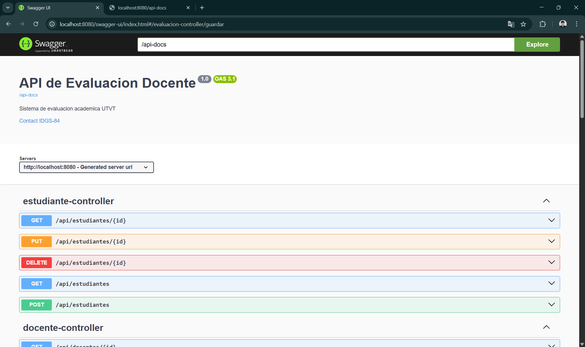
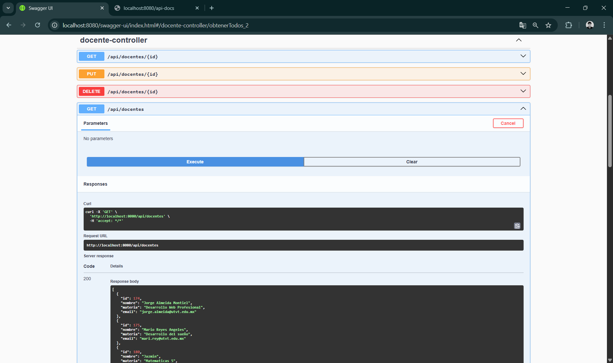
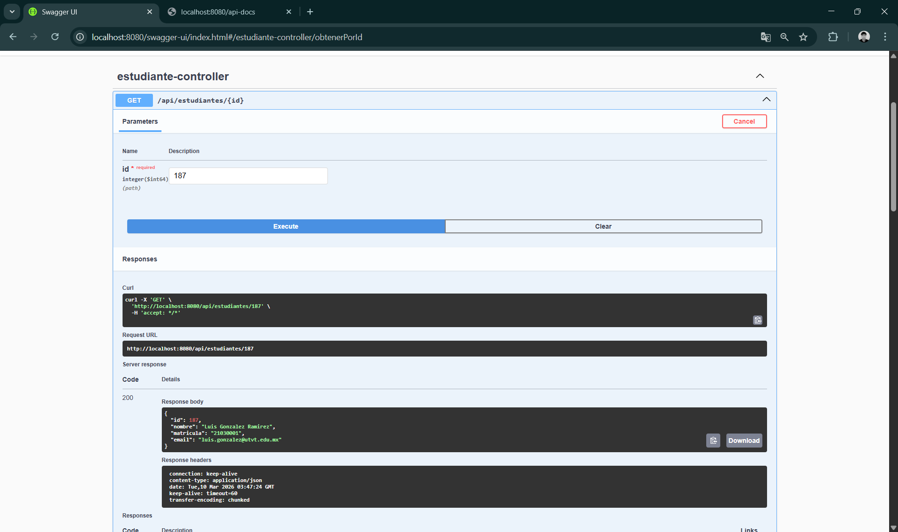
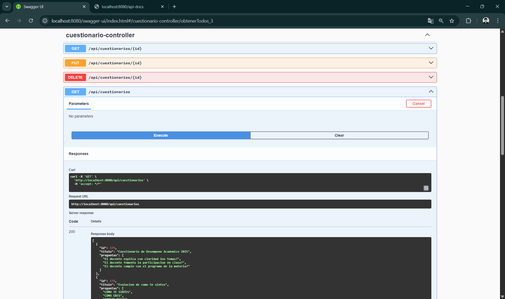
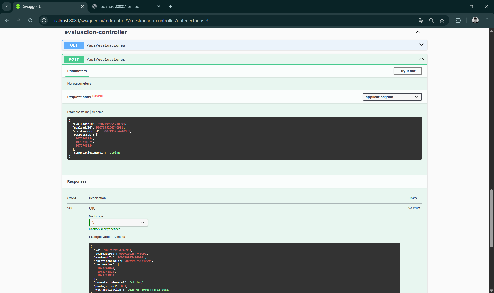
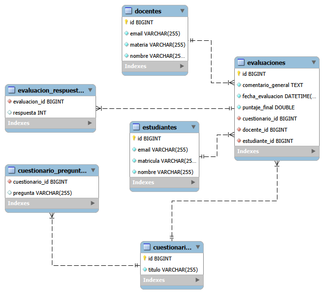

# Evaluacion Docente API

API REST para la gestion de evaluaciones academicas de la UTVT.

Actualmente expone CRUD para docentes, estudiantes, cuestionarios y evaluaciones, con persistencia en MySQL, documentacion OpenAPI (Swagger UI) y configuracion CORS para frontend local.

## Stack actual

- Java 17
- Spring Boot 4.0.3
- Spring Web
- Spring Data JPA
- Spring Validation
- MySQL Connector/J (runtime)
- H2 (solo pruebas)
- MapStruct 1.5.5
- Lombok
- Springdoc OpenAPI 2.8.6
- Maven Wrapper (`mvnw`, `mvnw.cmd`)

## Estructura del proyecto

```text
src/main/java/mx/utvt/evaluaciondocente
|- config        # CORS y OpenAPI
|- controller    # Endpoints REST
|- dto           # Objetos de transferencia
|- entity        # Entidades JPA
|- exception     # Manejador global de errores
|- mapper        # Mappers MapStruct
|- repository    # Repositorios Spring Data
`- service       # Logica de negocio
```

## Requisitos

- JDK 17 instalado
- MySQL Server activo
- Base de datos creada: `evaluacion_db`
- Maven Wrapper del proyecto

## Configuracion

El archivo activo es `src/main/resources/application.properties`.

Configuracion actual:

```properties
spring.datasource.url=jdbc:mysql://localhost:3306/evaluacion_db?useSSL=false&serverTimezone=UTC&allowPublicKeyRetrieval=true
spring.datasource.username=root
spring.datasource.password=password
spring.jpa.hibernate.ddl-auto=update
spring.jpa.show-sql=true
server.port=8080

springdoc.api-docs.path=/api-docs
springdoc.swagger-ui.path=/swagger-ui.html

app.cors.allowed-origins=http://localhost:3000,http://127.0.0.1:3000
```

> Recomendado: mover credenciales sensibles a variables de entorno o un perfil local no versionado.

## Ejecucion local

### 1) Compilar y ejecutar

```powershell
.\mvnw.cmd spring-boot:run
```

### 2) Ejecutar pruebas

```powershell
.\mvnw.cmd test
```

La aplicacion queda en:

- API base: `http://localhost:8080`
- Swagger UI: `http://localhost:8080/swagger-ui.html`
- OpenAPI JSON: `http://localhost:8080/api-docs`

## Endpoints REST actuales

Todos los endpoints estan bajo el prefijo `/api`.

### Docentes (`/api/docentes`)

- `GET /api/docentes`
- `GET /api/docentes/{id}`
- `POST /api/docentes`
- `PUT /api/docentes/{id}`
- `DELETE /api/docentes/{id}`

### Estudiantes (`/api/estudiantes`)

- `GET /api/estudiantes`
- `GET /api/estudiantes/{id}`
- `POST /api/estudiantes`
- `PUT /api/estudiantes/{id}`
- `DELETE /api/estudiantes/{id}`

### Cuestionarios (`/api/cuestionarios`)

- `GET /api/cuestionarios`
- `GET /api/cuestionarios/{id}`
- `POST /api/cuestionarios`
- `PUT /api/cuestionarios/{id}`
- `DELETE /api/cuestionarios/{id}`

### Evaluaciones (`/api/evaluaciones`)

- `GET /api/evaluaciones`
- `GET /api/evaluaciones/{id}`
- `POST /api/evaluaciones`
- `DELETE /api/evaluaciones/{id}`

## CORS

La politica CORS esta aplicada a `"/api/**"` con:

- Origenes permitidos configurables en `app.cors.allowed-origins`
- Metodos: `GET, POST, PUT, PATCH, DELETE, OPTIONS`
- `allowCredentials=false`
- `maxAge=3600`

## Manejo de errores

`GlobalExceptionHandler` devuelve respuestas JSON para:

- `MethodArgumentNotValidException` -> `400 Bad Request` con errores por campo
- `RuntimeException` -> `404 Not Found`
- `Exception` generica -> `500 Internal Server Error`

## Estado de pruebas

Actualmente existe prueba de carga de contexto:

- `src/test/java/mx/utvt/evaluaciondocente/EvaluacionDocenteApplicationTests.java`

Siguiente paso recomendado: agregar pruebas unitarias de servicios y pruebas de integracion para controladores.

## Documentacion OpenAPI

Los metadatos de Swagger/OpenAPI se leen de propiedades `app.openapi.*`:

- `app.openapi.title`
- `app.openapi.version`
- `app.openapi.description`
- `app.openapi.contact.name`
- `app.openapi.contact.email`

### Capturas de pantalla

#### Interfaz Swagger UI



#### Endpoints de Docentes



#### Endpoints de Estudiantes



#### Endpoints de Cuestionarios



#### Endpoints de Evaluaciones



#### Schemas/Modelos



## Notas de mantenimiento

- `spring.jpa.hibernate.ddl-auto=update` es practico para desarrollo, pero se recomienda migraciones versionadas para produccion.
- Si cambias puerto o rutas de Swagger, actualiza este README para mantener consistencia.
